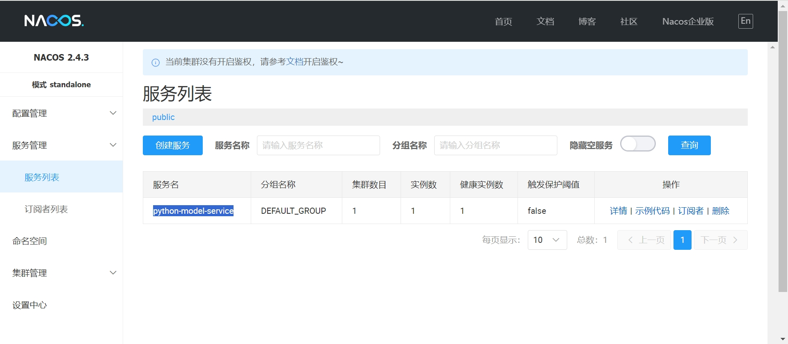
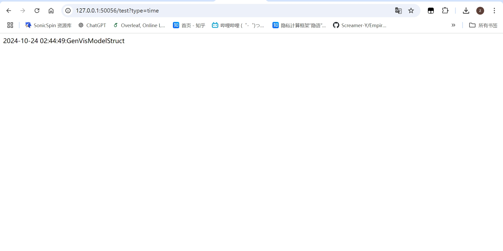

# nacos使用参考
## 一、nacos安装部署
nacos可从[官方网站](https://nacos.io/download/nacos-server/)上进行下载与安装，推荐版本为2.4.3.

nacos官网上还提供了详细的[安装部署教程](https://nacos.io/docs/latest/quickstart/quick-start/)

此外，官方也提供了对于nacos各项api的详尽介绍与开发流程，对于想要完成拓展任务的同学可自行查阅相关资料。

## 二、nacos+python+flask
在实际生产情况中，各项数据均保存在各级别部门的数据库中，然后通过部署集群以形成微服务群并进行管理。鉴于以上内容过于复杂且本实验的目的只是让学生了解nacos和服务化发布的方法，故本实验采取一种较为简单的方式进行部署，即nacos+python+flask：

- python：相比于java需要简单易用，不用费时费力地配置各种文件
- flask：⼀款⾮常流⾏的Python Web微框架，简洁、扩展性强、开发效率高，在本实验中替代数据库系统服务，来用于数据服务生成
- nacos：发现、管理微服务

后续内容，我将以时间查询微服务(example.py)为例，介绍nacos+python+flask的具体开发流程，同学们可基于此，以服务化的形式进行数据发布，以及按照BPMN规范进行服务组合等拓展任务的完成。

1. python相关包引入

执行以下命令
```bash 
pip install nacos-sdk-python
pip install flask
```
2. 服务创建

示例代码创建了一个查询时间的微服务，它能根据输入参数的不同，返回不同结果：
```python
class TestModelServicer():

    def test_function(self, data):
        if data == "time":
            current = time.strftime("%Y-%m-%d %H:%M:%S", time.localtime())
        else:
            current = "你好呀"
        print(current + ":" + "GenVisModelStruct")
        return current + ":" + "GenVisModelStruct"

@app.route('/test', methods=['GET'])
def square():
    print("收到请求")
    data = request.args.get('type')
    print(data)
    my_class_instance = TestModelServicer()
    result = my_class_instance.test_function(data)
    return result
```

3. 服务注册
使用nacos的服务注册api，以post方式访问api链接，完成服务注册
```python
def service_register(port):
    url = "http://127.0.0.1:8848/nacos/v2/ns/instance?serviceName=" + SERVICE_NAME + "&ip=" + IP + "&port=" + str(port)
    res = requests.post(url)
    print(res.json())
    print("完成注册")
```

4. 心跳检测
由于本实验注册的服务为临时服务，需要随时向nacos发送心跳以证明服务还存活(有资料说新版本nacos已经不需要临时服务进行心跳检测了，大家可自行验证)
```python
def service_beat():
    while True:
        url = "http://127.0.0.1:8848/nacos/v1/ns/instance/beat?serviceName=" + SERVICE_NAME + "&ip=" + IP + "&port=" + str(global_port)
        res = requests.put(url)
        # print("心跳检测中... 响应状态码： {res.status_code}")
        time.sleep(5)
```

5. 执行结果
在执行代码完成注册后，登录[nacos控制台](http://127.0.0.1:8848/nacos)，查看服务列表，会发现出现了服务python-model-service



然后访问 http://127.0.0.1:50056/test?type=time (nacos的ip+服务注册端口+路径+查询参数)，可以看到网页显示了时间
